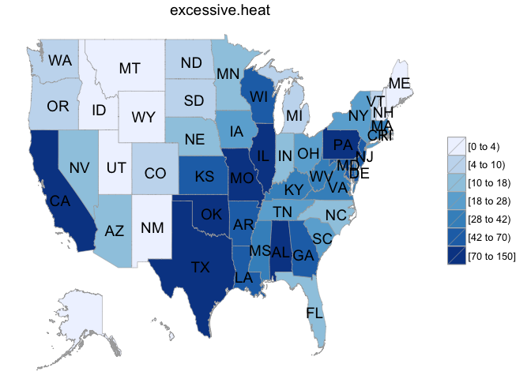
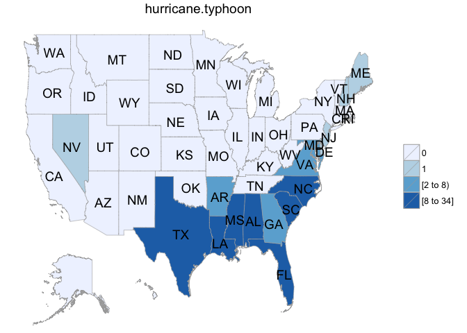

# Hazardous Storms: Analysis of NOAA Storm Data
Peter W Setter  
March 15, 2015  

### Synopsis
I analyzed the National Oceanic and Atmospheric Association's Storm Database and created three metrics of hazard to humans: fatalities per event, injuries per event, and total property and crop damage per event. Using these metrics, I determined that by fatalities per event, tsunamis and excessive heat are the most hazardous; by injuries per event, tsunamis and hurricanes are the most hazardous; and by property and crop damage per event, hurricanes and storm surge are the most hazardous. An examination of state-by-state frequency of hurricanes and excessive heat events provided more detail for governmental managers in planning storm responses.

### Questions
This analysis answers the questions:

1. Across the United States, which types of events are most harmful with respect to population health?
2. Across the United States, which types of events have the greatest economic consequences?

### Hardware and Software
This analysis used a Macbook 2,1 running OSX 10.6.8 with a Intel Core 2 Duo processor and 2 GB of RAM. The software was R 3.1.2 run within RStudio Version 0.98.1087. 

### Data Processing
I begin by loading the packages necessary for the data processing and analysis. `R.utils` provides a function to unzip the data file. `dplyr` is used for data manipulation. `lubridata` provides functions for parsing time values. `stringr` provides functions for string searching and subsetting. `choroplethr` and `choroplethrMaps` will be used to create figures. `datasets` provide vectors of state names and abbreviations.


```r
library(R.utils)
```

```
## Warning: package 'R.utils' was built under R version 3.1.3
```

```
## Loading required package: R.oo
## Loading required package: R.methodsS3
## R.methodsS3 v1.7.0 (2015-02-19) successfully loaded. See ?R.methodsS3 for help.
## R.oo v1.18.0 (2014-02-22) successfully loaded. See ?R.oo for help.
## 
## Attaching package: 'R.oo'
## 
## The following objects are masked from 'package:methods':
## 
##     getClasses, getMethods
## 
## The following objects are masked from 'package:base':
## 
##     attach, detach, gc, load, save
## 
## R.utils v2.0.0 (2015-02-28) successfully loaded. See ?R.utils for help.
## 
## Attaching package: 'R.utils'
## 
## The following object is masked from 'package:utils':
## 
##     timestamp
## 
## The following objects are masked from 'package:base':
## 
##     cat, commandArgs, getOption, inherits, isOpen, parse, warnings
```

```r
library(dplyr)
```

```
## 
## Attaching package: 'dplyr'
## 
## The following object is masked from 'package:stats':
## 
##     filter
## 
## The following objects are masked from 'package:base':
## 
##     intersect, setdiff, setequal, union
```

```r
library(lubridate)
library(stringr)
library(choroplethr)
library(choroplethrMaps)
library(datasets)
```

The data used in this analysis is the U.S. National Oceanic and Atmospheric Administration's Storm Database and is available [here](https://d396qusza40orc.cloudfront.net/repdata%2Fdata%2FStormData.csv.bz2)

I begin by downloading, unzipping, and reading the data. The data is immediately converted to a data frame tbl, the class used by `dplyr`.


```r
storm.data.url <- "https://d396qusza40orc.cloudfront.net/repdata%2Fdata%2FStormData.csv.bz2"
download.file(storm.data.url, destfile = "StormData.csv.bz2", method = "curl")
Sys.time() # Time of downloading data
```

```
## [1] "2015-03-09 06:20:12 CDT"
```

```r
bunzip2(filename = "StormData.csv.bz2", overwrite = TRUE)
storm.data <- tbl_df(read.csv("StormData.csv", header=TRUE))
```

My next steps will involve cleaning and tidying. I'll start with several basic tasks:

* Convert all the `EVTYPE` factors to lower case
* Convert the `BGN_DATE` from a factor into `POSIXct` format
* Create `prop.dmg`, which multiplies `PROPDMG` by `PROPDMGEXP` to give the property damage in dollars (This ensures the variable is in one column rather than two.)
* Create `crop.dmg`, which multiples `CROPDMG` by `CROPDMGEXP` to give the property damage in dollars (Again, isolating the variable to one column.)
* Selecting the columns of interest for this study -- date, state, injuries, fatalities, and damage costs -- while tidying the column names by changing them to lower case
* Filtering the results for events in 1996 and later

The final step was performed because the data prior to this date is [more complete](https://class.coursera.org/repdata-012/forum/thread?thread_id=29#comment-28). Given the size of storm.data, it is removed in order to free up resources.


```r
storm.data2 <- storm.data %>%  
        mutate(event = tolower(EVTYPE), 
               date = mdy_hms(BGN_DATE),
               prop.dmg = ifelse(PROPDMGEXP == 'K', PROPDMG*1000,
                                  ifelse(PROPDMGEXP == 'M', PROPDMG*1e6,
                                        ifelse(PROPDMGEXP == 'B', PROPDMG*1e9, 0))),
               crop.dmg = ifelse(CROPDMGEXP == 'K', CROPDMG*1000,
                                  ifelse(CROPDMGEXP == 'M', CROPDMG*1e6,
                                        ifelse(CROPDMGEXP == 'B', CROPDMG*1e9, 0)))) %>% 
        select(date, event, state = STATE, fatalities = FATALITIES, 
               injuries = INJURIES, prop.dmg, crop.dmg) %>% 
        filter(date > ymd('1995-12-31'))
rm(storm.data)
```

Looking at `storm.data2` I see that there are many more events in the data set than the 48 mentioned in the [documentation](https://d396qusza40orc.cloudfront.net/repdata%2Fpeer2_doc%2Fpd01016005curr.pdf). 


```r
length(unique(storm.data2$event))
```

```
## [1] 438
```

The next task will be to clean the data by combing factors so they fall within the permitted categories. If the listing is unknown or difficult to determine, it will be placed in the category `other`. `Combine.events` is a function that returns a permitted event name based on on an `event`. By coupling `any` with `str_detect`, we can look for abbreviations and misspellings, e.g. "tstm" for "thunderstorm" and "wnd" for "wind".

Overview on how labels were combined:

* Marine events were classified first in order to avoid incorrect classification
* Snow squalls were classified as `winter.storm`
* Heavy or "record" snow was classified `heavy.snow`
* All other snow events, along with other winter precipitation, were classified as `winter.weather`
* "Glaze" and "black ice" were classified as `frost.freeze`
* Remnants of hurricanes were classified as `tropical.depression`
* Any event labeled with surf or sea was classified as `high.surf`
* Whirlwinds and wall clouds were grouped within `funnel.cloud` since they are related weather events
* Unless specified as coastal, lake, or flash, all any label containing "flood" was classified as a `flood`
* As per the documentation, all land- and mudslides were classified as `debris.flow`
* If a event labeled included "extreme", "record", "excessive", "extended", or "hypothermia", is was classified as `extreme.cold.wind.chill`
* Other cold, chill, and cool events were classified as `cold.wind.chill`
* Similarly, when "excessive" or "record" were coupled with a synonym for "hot", it was classified as `excessive.heat` otherwise it was simply `heat`
* "Dry" and "low rain" were classified as `drought`
* All fires were classified as `wildfire`

With the function defined, I first create a data frame tbl called `storm.clean`. I utilize vapply to overwrite the `event` with each `event` properly classified. Please see this [StackOverflow post](http://stackoverflow.com/questions/9668456/why-does-sapply-return-a-list) for an explanation on the use of vapply. Last, the `event` column is transformed from `character`s into `factor`s.


```r
Combine.events <- function(event) {
        if(str_detect(event, 'marine')) {
                if (any(str_detect(event, c('tstm', 'thunderstorm')))) {
                        return('marine.thunderstorm.wind')
                } else if (str_detect(event, 'hail')) {
                        return('marine.hail')
                } else if (str_detect(event, 'high')) {
                        return('marine.high.wind')
                } else if (str_detect(event, 'strong')) {
                        return('marine.strong.wind')
                } else {
                        return('other')
                }
        } else if (any(str_detect(event, 
                        c('winter storm', 'snow squall')))) {
                return('winter.storm')
        } else if (any(str_detect(event, c('flurries', 'icy', 'mixed', 'ic. road', 'freezing', 'wintry')))) {
                return('winter.weather')
        } else if (str_detect(event, 'ice storm')) {
                return('ice.storm')      
        } else if (str_detect(event, 'sleet')) {
                return('sleet')
        } else if (str_detect(event, 'snow')) {
                if (any(str_detect(event, c('heavy', 'record')))) {
                        return('heavy.snow')
                } else if (str_detect(event, 'lake')) {
                        return('lake.effect.snow')
                } else {
                        return('winter.weather')
                }
        } else if (str_detect(event, 'blizzard')) {
                return('blizzard')
        } else if (any(str_detect(event, 
                        c('freeze', 'frost', 'glaze', 'black ice')))) {
                return('frost.freeze')
        } else if (any(str_detect(event, c('tropical', 'remnant')))) {
                if (str_detect(event, 'storm')) {
                        return('tropical.storm')
                } else {
                        return('tropical.depression')
                }
        } else if (any(str_detect(event, c('hurricane', 'typhoon')))) {
                return('hurricane.typhoon')
        } else if (any(str_detect(event, c('surf', 'sea')))) {
                return('high.surf')
        } else if (str_detect(event, 'tsunami')) {
                return('tsunami')
        } else if (str_detect(event, 'tornado')) {
                return('tornado')       
        } else if (str_detect(event, 'spout')) {
                return('waterspout')
        } else if (any(str_detect(event, c('funnel', 'whirl', 'wall')))) {
                return('funnel.cloud')
        } else if (any(str_detect(event, c('hail', 'ice pellet')))) {
                return('hail')
        } else if (any(str_detect(event, c('flood', 'fld', 'beach', 'jam')))) {
                if (any(str_detect(event, c('costal', 'cstl', 'tidal', 'beach')))) {
                        return('costal.flood')
                } else if (str_detect(event, 'flash')) {
                        return('flash.flood')
                } else if (str_detect(event, 'lake')) {
                        return('lakeshore.flood')
                } else {
                        return('flood')
                }
        } else if (any(str_detect(event, c('slide', 'slump')))) {
                return('debris.flow')
        } else if (any(str_detect(event, c('cold', 'chill', 'cool')))) {
                if (any(str_detect(event, 
                        c('extreme', 'record', 'excessive', 
                          'extended', 'thermia')))) {
                        return('extreme.cold.wind.chill')
                } else {
                        return('cold.wind.chill')
                }
        } else if (any(str_detect(event, c('heat', 'warm', 'high temp', 'hot')))) {
                if(any(str_detect(event, c('excessive', 'record')))) {
                        return('excessive.heat')
                } else {
                        return('heat')
                }
        } else if (any(str_detect(event, c('lightning','lighting')))) {
                return('lightning')
        } else if (str_detect(event, 'avalanc')) {
                return('avalanche')
        } else if (str_detect(event, 'rip')) {
                return('rip.current')
        } else if (str_detect(event, 'surge')) {
                return('storm.surge')
        } else if (any(str_detect(event, 
                        c('drought', 'record dry', 'hot and dry', 
                          'dry spell', 'low rain')))) {
                return('drought')
        } else if (str_detect(event, 'fire')) {
                return('wildfire')
        } else if (str_detect(event, 'dust')) {
                if (str_detect(event, 'dev.l')) {
                        return('dust.devil')
                } else {
                        return('dust.storm')
                }
        } else if (any(str_detect(event, c('wind', 'wnd', 'burst')))) {
                if(any(str_detect(event, c('tstm', 'thunderstorm', 'burst')))
                   & !str_detect(event, 'non')) {
                        return('thunderstorm.wind')
                } else if (str_detect(event, 'high')) {
                        return('high.wind')
                } else {
                        return('strong.wind')
                } 
        } else if (any(str_detect(event, c('fog', 'vog')))) {
                if (any(str_detect(event, c('freezing', 'ice')))) {
                        return('freezing.fog')
                } else {
                        return('dense.fog')
                }
        } else if (str_detect(event, 'smoke')) {
                return('dense.smoke')
        } else if (str_detect(event, 'volcan')) {
                return('volcanic.ash')
        } else if (any(str_detect(event, 
                        c('rain', 'thunderstorms', 'coastal storm', 
                          'wet', 'tstm', 'precipitaiton')))) {
                return('heavy.rain')
        } else if (any(str_detect(event, c('blow-out', 'astronomical low')))) {
                return('astronomical.low.tide')
        } else if (any(str_detect(event, c('swell', 'seiche', 'wave')))) {
                return('seiche')
        } else {
                return('other')
        }
}

storm.clean <- storm.data2
storm.clean$event <- vapply(storm.clean$event, Combine.events, character(1))
storm.clean$event <- as.factor(storm.clean$event)
```

If I examine the head of the data frame tbl, I notice that there are several entries that have the same `date`, `event`, and `state`. (Also, since storm.data2 is no longer needed, it is removed to free up space.)


```r
rm(storm.data2)
head(storm.clean)
```

```
## Source: local data frame [6 x 7]
## 
##         date             event state fatalities injuries prop.dmg crop.dmg
## 1 1996-01-06      winter.storm    AL          0        0   380000    38000
## 2 1996-01-11           tornado    AL          0        0   100000        0
## 3 1996-01-11 thunderstorm.wind    AL          0        0     3000        0
## 4 1996-01-11 thunderstorm.wind    AL          0        0     5000        0
## 5 1996-01-11 thunderstorm.wind    AL          0        0     2000        0
## 6 1996-01-18              hail    AL          0        0        0        0
```

Large events can affect several parts of a state or multiple states. Each county or region may each file a separate report. To best understand each event, I can group the data by `date`, `event`, and `state`, and then report the the total property damage, the total crop damage, the total damage, total fatalities, and total injuries. I chose to group by state, because disaster relief is typically performed at the state level with potential federal support. The resulting data frame tbl is called `storm.group`.


```r
storm.group <- storm.clean %>% 
        group_by(date, event, state) %>% 
        summarize(all.fatalities = sum(fatalities),
                  all.injuries = sum(injuries),
                  all.prop.dmg = sum(prop.dmg),
                  all.crop.dmg = sum(crop.dmg),
                  all.dmg = all.prop.dmg + all.crop.dmg)

reported.events <- nrow(storm.clean)
grouped.events <- nrow(storm.group)
```

There are 653530 events recorded in the data set, but after grouping, I see there are 158121. If events were grouped by neighboring state, this figure would likely decrease even more.

### Results
With the data cleaned and tided, I begin the analysis by identifying the weather events that are the most hazardous to human health. It is done by summing the injuries and fatalities. In addition, I will count the number of events.


```r
hazard.health <- storm.group %>%
        group_by(event) %>%
        summarize(total.fatalities = sum(all.fatalities),
                  total.injuries = sum(all.injuries),
                  count = n(),
                  fatalities.per.event = round(total.fatalities/count, 1),
                  injuries.per.event = round(total.injuries/count), 1) %>%
        arrange(desc(fatalities.per.event))

head(hazard.health, 5)
```

```
## Source: local data frame [5 x 7]
## 
##               event total.fatalities total.injuries count
## 1           tsunami               33            129    10
## 2    excessive.heat             1799           6391  1547
## 3       rip.current              542            503   659
## 4 hurricane.typhoon              125           1328   175
## 5         avalanche              223            156   361
## Variables not shown: fatalities.per.event (dbl), injuries.per.event (dbl),
##   1 (dbl)
```

Looking at the events that cause the most loss of life, the top five are

1. Tsunami
2. Excessive Heat
3. Rip Currents
4. Hurricanes
5. Avalanche

I note that tsunamis were infrequent, only 10 recorded in the 11 years of the data set. Excessive heat and rip current were both deadly and common.

I can arrange the table and consider the number of injuries per event.


```r
head(arrange(hazard.health, desc(injuries.per.event)), 5)
```

```
## Source: local data frame [5 x 7]
## 
##               event total.fatalities total.injuries count
## 1           tsunami               33            129    10
## 2 hurricane.typhoon              125           1328   175
## 3    excessive.heat             1799           6391  1547
## 4           tornado             1511          20667  7114
## 5              heat              237           1294   630
## Variables not shown: fatalities.per.event (dbl), injuries.per.event (dbl),
##   1 (dbl)
```

As before, tsunamis have the greatest impact on human health, and heat, in its two designations, are placed similar to before. Under this metric, the effect of hurricanes and tornadoes are seen.

Turning my attention to the damage caused by storms, I can perform an operation like that before. I create a new data frame tbl `most.cost`, which summarizes the total property, crop, and overall damage.


```r
most.cost <- storm.group %>%
        group_by(event) %>%
        summarize(total.prop.dmg = sum(all.prop.dmg),
                  total.crop.dmg = sum(all.crop.dmg),
                  count = n(),
                  prop.dmg.per.event = round(total.prop.dmg/count, 1),
                  crop.dmg.per.event = round(total.crop.dmg/count, 1),
                  total.cost.per.event = prop.dmg.per.event + crop.dmg.per.event) %>%
        arrange(desc(total.cost.per.event)) %>%
        select(event, total.cost.per.event, count, 2, 3, 5, 6)

head(most.cost, 5)
```

```
## Source: local data frame [5 x 7]
## 
##               event total.cost.per.event count total.prop.dmg
## 1 hurricane.typhoon            497537125   175    81718889010
## 2       storm.surge            218427301   219    47834724000
## 3    tropical.storm             29091561   286     7642475550
## 4           tsunami             14408200    10      144062000
## 5             flood             13781842 10850   144519820760
## Variables not shown: total.crop.dmg (dbl), prop.dmg.per.event (dbl),
##   crop.dmg.per.event (dbl)
```

Hurricanes and storm surges rank highest and are an order of magnitude greater in their total cost per event. Tropical storms add to the cost of extreme ocean storms. Tsunamis are also ranked high. Floods rank fifth, but are approximately 50 times more common than hurricanes, storm surge, and tropical storms. 

#### Differences across states
Hurricanes and excessive heat are two of most hazardous event types. It is of interest to examine the the frequency of these events across the states. In the code below, I group the data by state and event, and then determine an aggregate frequency. The resulting data frame tbl, `state.summary` is used by the function `Make.map` to construct a choropleth map. I first examine the frequency of excessive heat events.


```r
state.summary <- storm.group %>%
                group_by(state, event) %>%
                summarize(count = n())

Make.map <- function(event.name) {
        map.data <- as.data.frame(matrix(rep(c(0, 0), 50), nrow = 50))
        for(index in 1:50) {
                map.data[index, 1] <- tolower(state.name[index])
                state.result <- filter(state.summary, state == state.abb[index],
                                       event == event.name)
                map.data[index, 2] <- as.numeric(state.result[1, 3])
        }
        names(map.data) <- c('region', 'value')
        map.data[is.na(map.data)] <- 0
        state_choropleth(map.data, title = event.name)
}
```


```r
Make.map('excessive.heat')
```

```
## Warning in self$bind(): The following regions were missing and are being
## set to NA: district of columbia
```

 

Examining this choropleth of excessive heat frequency, it appears that excessive heat occurs in many regions of the country, with the highest frequencies in California, Texas, Oklahoma, Missouri, Alabama, Illinois, and Pennsylvania. 


```r
Make.map('hurricane.typhoon')
```

```
## Warning in self$bind(): The following regions were missing and are being
## set to NA: district of columbia
```

 

Hurricanes and typhoons primarily affect the Southeast United States; however, they can impact states all along the East Coast.
